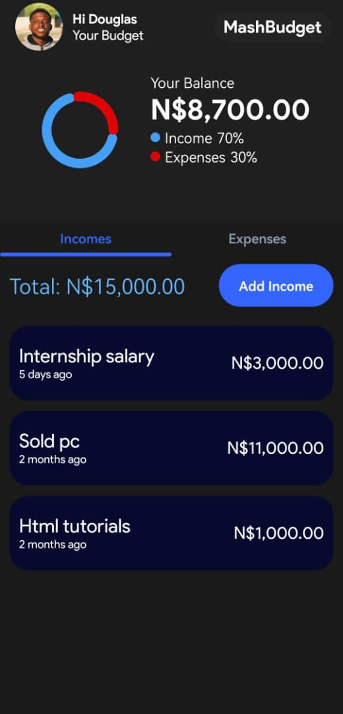
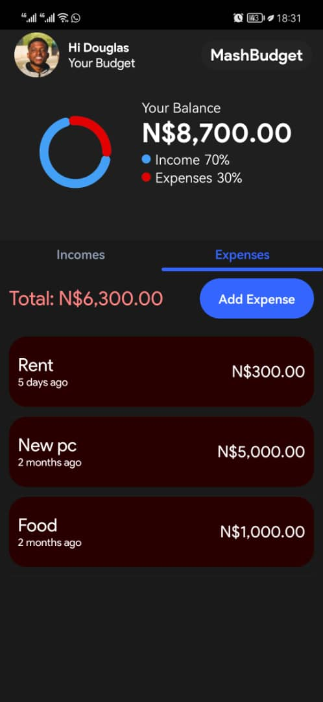
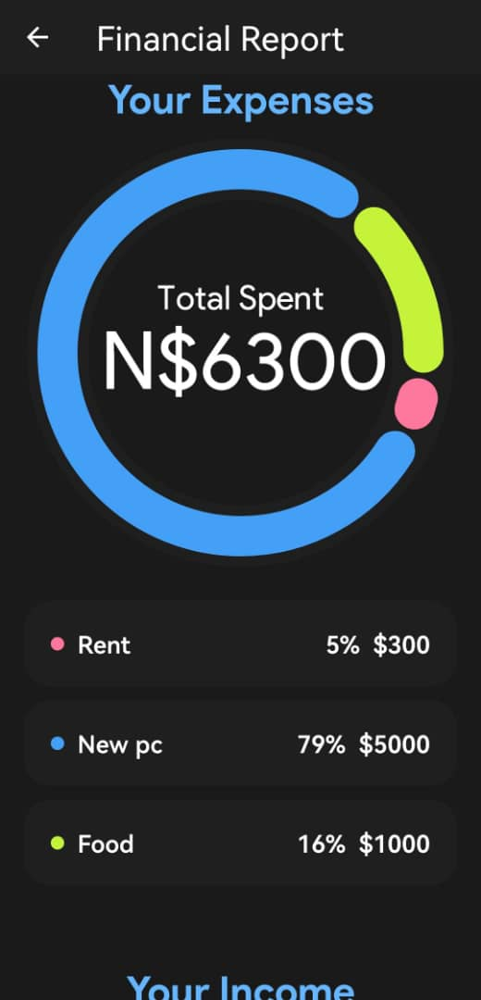
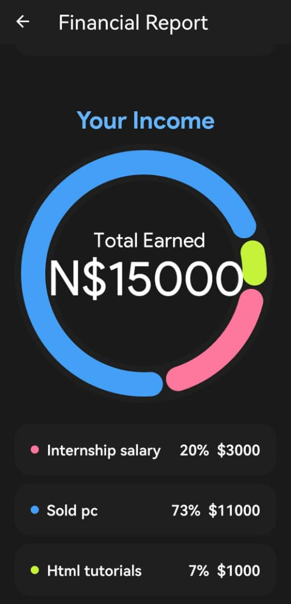

# MashBudget: Budgeting App

## Table of Contents
1. [Introduction](#introduction)
2. [Technology Stack](#technology-stack)
3. [App Structure](#app-structure)
4. [Navigation](#navigation)
5. [Screens and Components](#screens-and-components)
6. [Data Handling with Firebase](#data-handling-with-firebase)
7. [Visualizations](#visualizations)
8. [Development Process](#development-process)

## Introduction
MashBudget is a comprehensive mobile financial management app designed to help users track their income and expenses efficiently. The app provides features such as interactive data visualization, real-time balance calculation, and classification of income and expenses to support users in making informed financial decisions.

## Technology Stack
- **React Native**: The primary framework for building the cross-platform mobile application.
- **Expo**: Used to accelerate the development process by providing tools and libraries.
- **Firebase Firestore**: Serves as the backend database for storing financial data.
- **React Navigation**: Manages screen navigation within the application.
- **UI Kitten**: Provides customizable UI elements for a polished user interface.
- **Lottie React Native**: Displays animations to enhance the user interface.

## App Structure
MashBudget is organized into modular components with distinct screens and functionalities. The main screens include:
- Home Screen
- Income Screen
- Expense Screen
- Financial Report Screen

Each screen is responsible for specific financial management tasks, such as displaying financial data, adding/editing/deleting income or expense items, and visualizing data using charts.

## Navigation
React Navigation is used to control navigation within the app, allowing users to move smoothly between screens using stack, tab, and drawer navigation.

## Screens and Components
### Home Screen
The home screen displays key financial data, including the current balance, total income, and total expenses. It features interactive elements for easy navigation to other screens.

### Incomes Screen
The income screen allows users to add, edit, and delete income items. It includes a list view with filtering and categorization options.

 

### Expense Screen
The expense screen provides functionalities similar to the income screen, enabling users to manage their expenses effectively.

### Financial Report Screen
This screen offers data visualizations, helping users understand their financial patterns through charts and graphs.

## Data Handling with Firebase
Firebase Firestore is used for real-time synchronization of income and expense data. The robust security features and scalability make it an ideal choice for mobile applications.

## Visualizations
MashBudget uses various visualization tools to present financial data interactively, making it easier for users to grasp their financial status at a glance.

## Development Process
The app was developed using best practices and methodologies to ensure a smooth user experience. Continuous testing and user feedback were integral parts of the development process to refine the app's features and functionalities.

